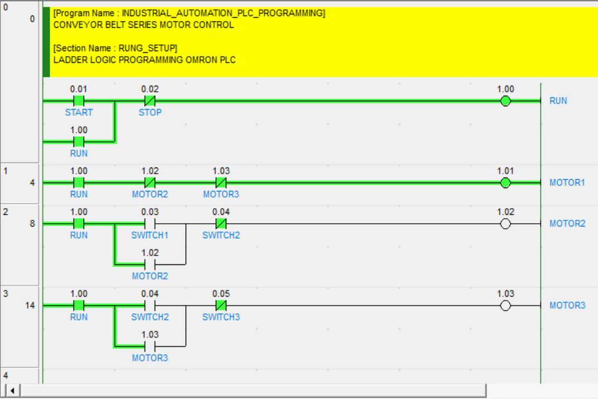

# Sequential Conveyor Belt Motor Control System

PLC-based sequential motion control of a three-conveyor belt line (M1–M3) with sensor-based product handoff (S1–S3), programmed in **Omron CX-Programmer** ladder logic, with start/stop control and live motor status indication on an **Omron PT-series HMI** screen.



## How It Works

A repeating start–transfer–return cycle moves the product across the three conveyors:

| Step | Event | Action |
|:----:|-------|--------|
| 1 | **START** button pressed | Motor **M1** runs – product comes out on conveyor 1 |
| 2 | Product detected at sensor **S1** | **M1** stops, motor **M2** runs |
| 3 | Product detected at sensor **S2** | **M2** stops, motor **M3** runs |
| 4 | Product detected at sensor **S3** | **M3** stops, **M1** runs again → cycle repeats from step 2 |
| 5 | **STOP** button pressed | All motors stop, sequence halts |

The sequence repeats continuously until stopped, and can be started/stopped either from the physical buttons or from the PT screen keys.

## I/O Assignment

| Tag | Address | Type | Function |
|-----|:-------:|------|----------|
| START | 0.00 | Input (NO pushbutton) | Starts the sequence |
| STOP | 0.01 | Input (NC pushbutton) | Stops the sequence |
| S1 | 0.02 | Input (product sensor) | Product at conveyor 1 → 2 handoff |
| S2 | 0.03 | Input (product sensor) | Product at conveyor 2 → 3 handoff |
| S3 | 0.04 | Input (product sensor) | Product discharged – cycle restart |
| M1 | 100.00 | Output (motor contactor) | Conveyor 1 motor |
| M2 | 100.01 | Output (motor contactor) | Conveyor 2 motor |
| M3 | 100.02 | Output (motor contactor) | Conveyor 3 motor |

Internal (work) relays used as stage latches:

| Relay | Function |
|-------|----------|
| H0.00 (RUN) | Sequence run latch – set by START, reset by STOP |
| H0.01 (ST2) | Stage-2 latch – product between S1 and S2 |
| H0.02 (ST3) | Stage-3 latch – product between S2 and S3 |

> Addresses are illustrative (CP-series style); remap them to match your PLC model and wiring.

## Ladder Logic Design

| Rung | Logic | Output |
|:----:|-------|:------:|
| 1 | `(START OR RUN) AND NOT STOP` | RUN |
| 2 | `(S1 OR ST2) AND RUN AND NOT S2 AND NOT STOP` | ST2 |
| 3 | `(S2 OR ST3) AND RUN AND NOT S3 AND NOT STOP` | ST3 |
| 4 | `RUN AND NOT S1 AND NOT ST2 AND NOT ST3` | M1 |
| 5 | `ST2` | M2 |
| 6 | `ST3` | M3 |

Key design points:

- **Latching (seal-in) circuits** – START seals in the RUN relay; each sensor sets the next stage latch, so momentary sensor pulses are enough to advance the sequence.
- **Mutual interlocking** – the stage latches guarantee that only one motor runs per transfer stage (M1 off while ST2 or ST3 is set).
- **Stop-dominant control** – STOP breaks the RUN latch and every stage latch, halting all motors from any point in the cycle.
- **Auto-repeating cycle** – S3 resets stage 3 and releases M1 again, so the sequence loops until STOP is pressed.

## HMI (Omron PT Screen)

- ON/OFF indication lamps for **M1**, **M2** and **M3**, driven directly from the PLC output bits.
- **START** and **STOP** screen keys writing to the same control bits as the panel pushbuttons.

## Tools & Environment

- **Omron CX-Programmer** – ladder programming, simulation and online monitoring
- **Omron CX-Designer** – PT-series HMI screen design
- **Omron PLC** (CP/CJ series) and PT-series HMI (or simulation only)

## Running the Project

1. Open the `.cxp` project file in CX-Programmer.
2. Compile the program and either go online with the PLC or launch the **simulation** workspace.
3. Force/toggle the inputs (START, S1–S3) and watch M1–M3 change state rung by rung in online monitor.
4. Open the PT project in CX-Designer and run the screen simulator to test the screen keys and motor lamps.

## Repository Structure

```
.
├── README.md      # This file
├── plc.png        # Ladder logic / system screenshot
└── conveyor.cxp   # CX-Programmer project (ladder + symbols)
```

## Author

Built as a hands-on PLC sequence-control practice project — interlocks, latching and HMI integration in classic Omron ladder style.
